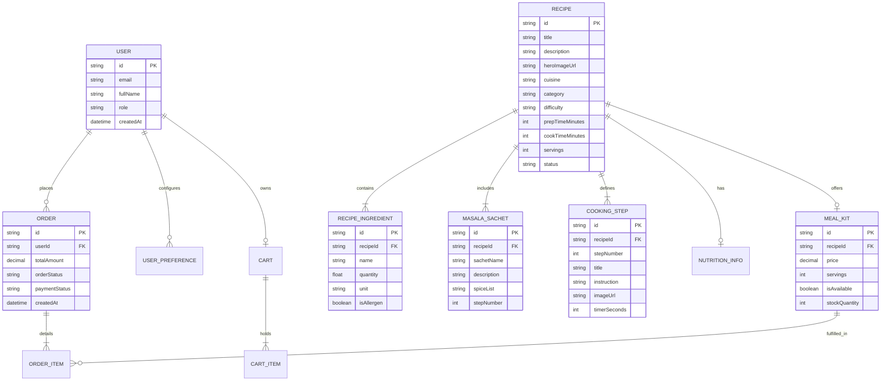

# Engineering Roadmap & Implementation Plan (`tasks.md`)
## RasoiGenie — React Native B2C Recipe & Pre-Portioned Meal-Kit Platform

---

## 1. Product Overview & Core Vision

**RasoiGenie** is a B2C mobile-first application designed to revolutionize home cooking. Users discover curated recipes, follow interactive step-by-step cooking instructions, and purchase pre-portioned ingredient packages delivered directly to their doorstep.

### Key Value Proposition (USP)
Users select a recipe and receive a meal kit containing all fresh ingredients along with custom spice blends and masalas pre-portioned into sealed sachets. This eliminates grocery shopping, ingredient wastage, and spice-mixing guesswork, making home cooking effortless, consistent, and quick.

### User Journey Flow
```text
[ Discover Recipe ] 
        ↓
[ View Recipe Details & Meal-Kit Option ] 
        ↓
[ Add Meal Kit to Cart ] 
        ↓
[ Checkout & Place Order ] 
        ↓
[ Order Delivered ] 
        ↓
[ Enter Step-by-Step Interactive Cooking Mode ] 
        ↓
[ Complete & Enjoy Meal ]
```

---

## 2. Scope Matrix

| Feature / Domain | MVP Scope (P0) | Post-MVP / Future (P1-P3) |
| :--- | :--- | :--- |
| **Auth** | Email/Password registration, login, JWT refresh tokens, persistent session, profile view | Social auth (Google/Apple), biometric login |
| **Recipe Discovery** | Home feed, categories, search (title/cuisine), difficulty & time filters, recipe cards | Personalized recommendations, trending tags |
| **Recipe Detail** | Hero image, prep/cook time, servings, ingredients list, masala sachet breakdown, nutrition info | Video previews, user reviews, scale servings |
| **Cooking UI** | Sequential step-by-step wizard, titles, images, interactive built-in step timers | Hands-free voice navigation, step AI assistant |
| **Meal Kit & Cart** | Associated kit pricing/availability, quantity adjustment, add/remove, cart persistence | Custom ingredient exclusions, extra sachet add-ons |
| **Checkout & Orders** | Delivery address form, checkout order summary, simulated payment flow, order status timeline | Live driver tracking, subscription plans |
| **Admin System** | Separate Web Admin portal (Next.js) for recipe creation, step editing, sachet config, publishing | Multi-vendor fulfillment portal, batch pricing |
| **AI "Genie" Engine**| Extensible data models for preferences, allergies, & historical intake | **Full AI recommendation engine**, macro gap analysis |

---

## 3. Architecture Decision Summary

| # | Technical Area | Decision | Rationale / Why | Alternatives Considered | Reason Alternatives Rejected |
|---|---|---|---|---|---|
| 1 | **Framework** | **Expo SDK 51+ (Managed Workflow with Prebuild)** | Native performance, fast iteration, Expo Dev Client for custom native code, seamless OTA updates, robust ecosystem. | Bare React Native CLI | Bare CLI adds high native maintenance overhead without significant benefit given modern Expo capabilities. |
| 2 | **Router / Navigation** | **Expo Router v3+** | File-based routing, native stack navigation built on React Navigation, typed routes, deep linking out of the box. | React Navigation (Imperative) | Expo Router provides better type safety, URL support, and cleaner directory organization. |
| 3 | **Language** | **TypeScript 5.x (Strict Mode)** | Complete end-to-end type safety, fewer runtime crashes, self-documenting code contracts. | Plain JavaScript | JavaScript lacks type safety; critical domain models (recipes, orders) need strict contracts. |
| 4 | **Client State** | **Zustand + MMKV** | Minimal boilerplate, high performance, unopinionated, instant synchronous local storage persistence. | Redux Toolkit, Context API | RTK has excessive boilerplate; React Context causes unnecessary component re-render cascades. |
| 5 | **Server State / Data Fetching**| **TanStack Query v5 (React Query)** | Automatic caching, background refetching, optimistic updates, request deduplication, loading/error state management. | SWR, RTK Query, manual `useEffect` | RTK Query requires Redux; manual `useEffect` leads to race conditions and duplicate fetch boilerplate. |
| 6 | **API Client & Validation** | **Axios + Zod** | Centralized interceptors (JWT attach/refresh), runtime data validation ensuring API payload compatibility. | Native `fetch` | Native `fetch` lacks built-in interceptor pipelines and automatic error transformation. |
| 7 | **Form Handling** | **React Hook Form + Zod Resolver** | Uncontrolled input performance, smooth React Native integration, strict schema validation sharing. | Formik | Formik re-renders the component tree on every keystroke, causing performance hits on mobile. |
| 8 | **Local Storage** | **`react-native-mmkv`** | Extremely fast C++ synchronous key-value storage (up to 30x faster than Async Storage). | `@react-native-async-storage/async-storage` | Async Storage is asynchronous, slower, and prone to storage bottlenecks during startup. |
| 9 | **Secure Storage** | **`expo-secure-store`** | Hardware-backed secure storage (iOS Keychain, Android KeyStore) for JWT tokens and sensitive session data. | MMKV (unencrypted) | Storing auth tokens in standard storage poses security risks if a device is compromised. |
| 10 | **Image Rendering** | **`expo-image`** | Memory & disk caching, progressive loading, blurhash placeholder support, modern WebP decoding. | React Native `<Image>` | Standard RN Image component suffers from caching bugs, memory leaks, and flickers on lists. |
| 11 | **Unit & Component Testing**| **Jest + React Native Testing Library (RNTL)**| Industry standard, behavior-driven UI testing, fast isolated unit execution. | Enzyme | Enzyme is deprecated and tightly coupled to React internal implementation details. |
| 12 | **End-to-End (E2E) Testing** | **Maestro** | Simple YAML test definitions, fast execution, highly reliable mobile automation, easy CI integration. | Detox, Appium | Detox requires complex native setup & fragile builds; Appium is slow and flaky. |
| 13 | **Git Hooks & Quality** | **Husky + lint-staged** | Prevents broken code, failing tests, or unformatted files from entering git history. | Manual pre-commit scripts | Manual scripts are easily bypassed and inconsistent across developer environments. |
| 14 | **List Rendering Performance**| **`@shopify/flash-list`** | Recycles views for smooth 60fps scrolling on long recipe lists with low memory consumption. | Standard `FlatList` | `FlatList` creates significant memory pressure and layout lag on large data sets. |
| 15 | **Admin Dashboard** | **Next.js 14+ (Web App)** | Decouples admin operations from mobile codebase; rich web table editing for complex recipe creation. | Embedded Admin screens in Mobile App | Embedded mobile admin bloats app bundle size and provides poor UX for data entry. |
| 16 | **Backend Stack** | **Node.js / Express or Fastify (REST API)** | JavaScript/TypeScript end-to-end synergy, lightweight, easily containerized. | Python / Django | Node.js allows sharing domain types and validation schemas directly between mobile, admin, and backend. |
| 17 | **Database & ORM** | **PostgreSQL + Prisma ORM** | Relational integrity for complex recipe/order schemas, strongly typed database queries, easy migrations. | MongoDB / Mongoose | Relational data (recipes -> ingredients -> sachets -> orders) fits PostgreSQL far better than NoSQL. |
| 18 | **Payment Architecture** | **Abstracted `PaymentService` Interface** | Decouples mobile checkout flow from payment gateway (Stripe/Razorpay); allows easy SDK swapping. | Hardcoded Stripe Integration | Hardcoding limits geographical expansion and payment gateway flexibility. |
| 19 | **Error & Crash Reporting** | **Abstracted `CrashReporter` (Sentry ready)**| Captures unhandled JS exceptions and native crashes in production with stack trace symbolication. | `console.log` / custom backend log | Manual logging misses native crashes and lacks breadcrumbs required to debug production bugs. |
| 20 | **Analytics Architecture** | **Abstracted `AnalyticsService` Event Bus**| Centralized event dispatching (`recipe_viewed`, `checkout_completed`) decoupled from provider SDKs. | Direct Mixpanel/PostHog SDK calls | Direct calls scatter third-party SDK dependencies across feature components. |
| 21 | **Offline Cooking Strategy** | **Zustand Local Cache for Active Recipe** | Saves current recipe steps & images locally so user can cook without network interruptions. | Complex offline CRDT sync | Full sync is over-engineered for MVP; simple local caching of active recipe suffices. |

---

## 4. Proposed Repository Structure

```text
RasoiGenie/
├── .github/
│   └── workflows/
│       ├── ci.yml                     # Continuous Integration pipeline (lint, typecheck, test)
│       └── build-check.yml            # Expo dry-run build validation
├── .husky/
│   ├── pre-commit                     # Runs lint-staged (lint, format, fast unit tests)
│   └── pre-push                       # Runs full typecheck and unit test suite
├── assets/
│   ├── fonts/                         # Custom brand typography (Inter / Outfit)
│   ├── icons/                         # SVG icons & app symbols
│   └── images/                        # Splash screen, fallback placeholders, onboarding graphics
├── e2e/
│   ├── flows/
│   │   ├── auth.yaml                  # Maestro E2E test: Login & Register flow
│   │   ├── recipe-search.yaml         # Maestro E2E test: Search & Filter recipes
│   │   └── checkout.yaml              # Maestro E2E test: Add to cart & complete checkout
│   └── config.yaml                    # Maestro global configuration
├── src/
│   ├── app/                           # Expo Router file-based navigation tree
│   │   ├── (auth)/                    # Unauthenticated route group
│   │   │   ├── login.tsx
│   │   │   └── register.tsx
│   │   ├── (tabs)/                    # Main bottom tabs route group
│   │   │   ├── index.tsx              # Home / Recipe Discovery screen
│   │   │   ├── search.tsx             # Recipe Search & Category filter screen
│   │   │   ├── orders.tsx             # Order History screen
│   │   │   └── profile.tsx            # User Profile & Preferences screen
│   │   ├── recipe/                    # Recipe details & cooking route group
│   │   │   ├── [id].tsx               # Recipe Detail screen
│   │   │   └── cook.tsx               # Interactive Cooking Mode screen
│   │   ├── cart/                      # Cart & Checkout route group
│   │   │   ├── index.tsx              # Cart review screen
│   │   │   ├── checkout.tsx           # Address & Payment selection screen
│   │   │   └── confirmation.tsx       # Order status confirmation screen
│   │   ├── _layout.tsx                # Global root layout & provider setup
│   │   └── +not-found.tsx             # Fallback 404 route
│   │
│   ├── components/                    # Shared design system components
│   │   ├── ui/                        # Low-level primitives (Button, Text, Input, Card, Badge, Modal)
│   │   ├── layout/                    # Layout primitives (ScreenWrapper, Container, Header, Spacer)
│   │   └── feedback/                  # UX states (LoadingSpinner, SkeletonCard, ErrorBoundary, EmptyState)
│   │
│   ├── features/                      # Feature modules (Domain-driven isolation)
│   │   ├── auth/                      # Authentication domain (login form, token storage, auth store)
│   │   ├── recipes/                   # Recipe discovery domain (recipe cards, grid, query hooks)
│   │   ├── cooking/                   # Cooking step wizard domain (step timer, progress bar, step card)
│   │   ├── cart/                      # Cart domain (cart item row, pricing summary, cart store)
│   │   ├── checkout/                  # Checkout domain (address picker, order placement hook)
│   │   ├── orders/                    # Order history domain (order card, delivery status timeline)
│   │   ├── profile/                   # User preferences domain (dietary flags, allergy settings)
│   │   └── nutrition/                 # Nutritional metadata domain (macro badge, future Genie schema)
│   │
│   ├── services/                      # Infrastructure & API layer abstractions
│   │   ├── api/                       # Axios client instance, endpoints config, error handling
│   │   ├── auth/                      # Secure Store token manager & auth API methods
│   │   ├── storage/                   # MMKV wrapper module
│   │   ├── payments/                  # Payment service interface & mock driver
│   │   └── analytics/                 # Event analytics abstraction facade
│   │
│   ├── store/                         # Global client state stores (Zustand)
│   │   ├── useCartStore.ts            # Cart items, quantity modifiers, subtotal computation
│   │   └── useCookingStore.ts         # Active cooking session state, step index, timers
│   │
│   ├── types/                         # Shared TypeScript domain contracts
│   │   ├── recipe.ts                  # Recipe, Ingredient, MasalaSachet, CookingStep schemas
│   │   ├── order.ts                   # Cart, CartItem, Order, DeliveryAddress schemas
│   │   ├── user.ts                    # User, Preferences, Allergy, DietaryPreference schemas
│   │   └── api.ts                     # APIResponse wrapper, ErrorResponse, Pagination metadata
│   │
│   ├── utils/                         # Reusable pure helper functions
│   │   ├── formatters.ts              # Currency formatting, time formatters (mins to hrs/mins)
│   │   ├── validation.ts              # Common Zod schema validators
│   │   └── logger.ts                  # Logger wrapper abstraction
│   │
│   └── constants/                     # System constants
│       ├── colors.ts                  # Design system color tokens (Dark mode HSL / Hex)
│       ├── typography.ts              # Font family, weights, scale tokens
│       └── config.ts                  # Environment variables & API base URLs
│
├── .env.example                       # Documented environment variable template
├── .eslintrc.js                       # ESLint flat configuration rules
├── .prettierrc                        # Code formatting configuration
├── app.json                           # Expo app configuration manifest
├── babel.config.js                    # Babel plugins (module-resolver, reanimated)
├── jest.config.js                     # Jest testing runner setup
├── metro.config.js                    # Metro bundler custom configuration
├── package.json                       # Project scripts & dependencies
├── tsconfig.json                      # Strict TypeScript settings & path aliases
└── tasks.md                           # Master engineering roadmap (This file)
```

---

## 5. Domain Model & Entities



---

## 6. API Architecture & Service Boundary

All mobile communication with the backend API flows through an explicit abstraction layer:

```text
[ React Native UI Component ]
          ↓
[ Domain Custom Hook (e.g., useRecipeDetail) ]
          ↓
[ TanStack Query (Server State Manager) ]
          ↓
[ API Client Service (Axios Instance + Zod Validation) ]
          ↓ (HTTPS / REST)
[ Backend Gateway API ]
```

### Core API Endpoint Specifications
- `POST /api/v1/auth/register` — Register a new consumer account
- `POST /api/v1/auth/login` — Authenticate and return JWT access + refresh tokens
- `POST /api/v1/auth/refresh` — Issue a new access token using a refresh token
- `GET /api/v1/users/me` — Fetch currently authenticated user profile & preferences
- `PATCH /api/v1/users/me/preferences` — Update dietary flags & allergy profile
- `GET /api/v1/recipes` — List published recipes (Query params: `category`, `search`, `page`, `limit`)
- `GET /api/v1/recipes/:id` — Fetch full recipe detail (ingredients, sachets, steps, kit info)
- `GET /api/v1/categories` — List recipe categories
- `POST /api/v1/cart/sync` — Sync local cart state with backend cart repository
- `POST /api/v1/orders` — Create a new order from cart (Server recalculates & validates pricing)
- `GET /api/v1/orders` — Fetch order history for current user
- `GET /api/v1/orders/:id` — Fetch individual order status & line items

---

## 7. State Management Architecture

```text
                       ┌─────────────────────────────────────────┐
                       │          RasoiGenie Application         │
                       └────────────────────┬────────────────────┘
                                            │
           ┌────────────────────────────────┴────────────────────────────────┐
           ▼                                                                 ▼
┌─────────────────────────────────────┐                   ┌─────────────────────────────────────┐
│    Server State (TanStack Query)    │                   │       Client State (Zustand)        │
├─────────────────────────────────────┤                   ├─────────────────────────────────────┤
│ • Recipe Feed & Details             │                   │ • Local Cart Items & Quantities     │
│ • User Profile & Preferences        │                   │ • Active Cooking Session Step Index │
│ • Order History & Status Timeline   │                   │ • Step Timers & Paused State        │
│ • Recipe Categories                 │                   │ • UI Modal Flags & Active Filters   │
└─────────────────────────────────────┘                   └─────────────────────────────────────┘
                                                                             │
                                                                             ▼
                                                          ┌─────────────────────────────────────┐
                                                          │   Persistence Layer (MMKV / Store) │
                                                          ├─────────────────────────────────────┤
                                                          │ • Cart state cached across restarts │
                                                          │ • Active step cached for crash recovery│
                                                          └─────────────────────────────────────┘
```

---

## 8. Admin Architecture Decision

> **Architectural Decision:** Admin recipe management **MUST** be implemented as a separate Web Application (Next.js) rather than embedding admin screens inside the React Native mobile application.

### Rationale
1. **User Experience:** Entering complex recipe data, multiple cooking steps, image uploads, and masala sachet breakdowns is tedious on a mobile touchscreen; a desktop web view with tabular forms provides far superior productivity.
2. **Security Isolation:** Mobile client bundles will not contain administrative code paths, RBAC logic, or sensitive moderation API endpoints.
3. **Bundle Size:** Omitting admin form libraries and rich text editors keeps the mobile application bundle lightweight and fast.

### Recipe Publishing Lifecycle
```text
[ DRAFT ] ──(Admin fills ingredients/steps/kit price)──> [ PUBLISHED ]
    ▲                                                          │
    │                                                          ▼
    └──────────────(Admin unpublishes for edits)───────── [ ARCHIVED ]
```

---

## 9. Testing Strategy & Testing Pyramid

```text
            / \
           /   \         E2E Tests (Maestro)
          / E2E \        • Critical user flows (Auth -> Search -> Add to Cart -> Checkout)
         /-------\
        /  Integ  \      Integration Tests (RNTL + MSW)
       /-----------\     • Screen navigation, state sync, API boundary validation
      /  Component  \    Component Tests (RNTL)
     /---------------\   • RecipeCard, CookingTimer, CartItem, StepWizard UI logic
    /      Unit       \  Unit Tests (Jest)
   /-------------------\ • Price calculations, timer formatters, Zod schema validation
```

### Snapshot Policy
Avoid raw component snapshot tests (`toMatchSnapshot()`) as they produce brittle false positives upon minor UI tweaks. Prefer functional behavior assertions (`getByRole`, `getByText`, `userEvent`).

---

## 10. Husky & Developer Tooling Strategy

### Hook Execution Rules
- **Pre-commit (`.husky/pre-commit`):** Runs `lint-staged` against staged files only.
  - ESLint fix (`eslint --fix`)
  - Prettier formatting check (`prettier --write`)
  - TypeScript incremental typecheck (`tsc --noEmit`)
  - Related unit tests (`jest --findRelatedTests`)
- **Pre-push (`.husky/pre-push`):** Runs complete workspace verification before pushing to remote.
  - Full TypeScript typecheck
  - Complete Jest test suite execution
  - Expo config validation

---

## 11. Code Quality & UX Standards

### Required Screen UI States
Every data-driven screen in the app **MUST** handle 5 primary states:
1. **Loading State:** Skeleton loaders matching card layouts (no blocking blank screens).
2. **Success State:** Rendered list or content with smooth entrance animations.
3. **Empty State:** Friendly graphic, clear explanation, and action button (e.g., "No recipes found — Clear Filters").
4. **Error State:** Human-readable error message with a prominent "Retry" button.
5. **Offline/Network State:** Banner notification indicating cached data display.

---

## 12. Security Architecture

- **Token Management:** Access JWTs held in memory; refresh tokens stored securely in `expo-secure-store`. Automatic silent refresh via Axios interceptors upon `401 Unauthorized`.
- **Server-Side Validation:** Prices, taxes, meal-kit availability, and order totals calculated on mobile are treated as **untrusted UI displays**. The backend API strictly recalculates and validates all line items and totals upon `POST /api/v1/orders`.
- **Environment Hygiene:** API keys and environment URLs managed strictly through `.env` files and exposed via `expo-constants` (never committed to git).

---

## 13. Future AI "Genie" Architecture (Readiness Layer)

While the AI Genie recommendation engine will not be implemented in MVP, the data schema includes reserved, extensible fields:

```typescript
// Future-ready domain interface (src/types/user.ts)
export interface UserDietaryProfile {
  dietaryPreference: 'VEGETARIAN' | 'NON_VEGETARIAN' | 'VEGAN' | 'EGGETARIAN' | 'KETO';
  allergies: string[]; // e.g., ["PEANUTS", "DAIRY", "SHELLFISH"]
  dislikedIngredients: string[];
  calorieTargetDaily?: number;
  macroTargets?: {
    proteinGrams: number;
    carbsGrams: number;
    fatGrams: number;
  };
}

export interface MealHistoryRecord {
  id: string;
  userId: string;
  recipeId: string;
  cookedAt: string;
  rating?: number;
  perceivedDifficulty?: 'EASY' | 'MEDIUM' | 'HARD';
}
```

---

## 14. Global Definition of Done (DoD)

A task in this roadmap is considered **DONE** only when all of the following conditions are met:
- [ ] Code is implemented according to specifications and design patterns.
- [ ] TypeScript compiles cleanly with zero `any` types or strict mode warnings.
- [ ] ESLint and Prettier rules pass without warnings or errors.
- [ ] Unit/Component/Integration tests written and passing (maintaining >80% coverage on domain logic).
- [ ] UX Loading, Empty, Error, and Retry states explicitly implemented and verified.
- [ ] Accessible UI labels (`accessibilityLabel`, `accessibilityHint`) added to interactive elements.
- [ ] Verified on both iOS Simulator and Android Emulator.
- [ ] Pre-commit hooks pass cleanly.

---

## 15. Hierarchical Task Execution Roadmap

```text
Task 1 (Architecture) ──► Task 2 (Init) ──► Task 3 (Tooling) ──► Task 4 (App Arch) ──► Task 5 (Auth)
                                                                                            │
Task 10 (Cart) ◄── Task 9 (Cooking) ◄── Task 8 (Detail) ◄── Task 7 (Discovery) ◄── Task 6 (Domain)
     │
     ▼
Task 11 (Checkout) ──► Task 12 (Orders) ──► Task 13 (Admin) ──► Task 14 (Testing) ──► Task 15-19 (Hardening & Release)
```

---

## 16. Detailed Task List (Hierarchical Structure)

### Task 1 — Architecture & Design Finalization

#### TASK-1.1 — Finalize System Architecture & Technical Specifications
**Priority:** P0 | **Phase:** 0 | **Depends on:** None
**Goal:** Formalize all engineering standards, architectural decisions, and directory layout for the project.
**Implementation:**
1. Document final tech stack choices (Expo SDK 51+, Expo Router v3, Zustand, TanStack Query).
2. Validate entity relation schemas and API contracts.
**Files affected:** `README.md`, `tasks.md`
**Acceptance Criteria:**
- [ ] Architecture document complete and validated.
- [ ] Domain models finalized.
**Tests:** N/A (Documentation)

---

### Task 2 — Project Initialization & Repository Setup

#### TASK-2.1 — Initialize Expo React Native Application with TypeScript
**Priority:** P0 | **Phase:** 1 | **Depends on:** TASK-1.1
**Goal:** Bootstrap the Expo React Native app with strict TypeScript template and file-based routing.
**Implementation:**
1. Execute `npx create-expo-app@latest ./ --template tabs`.
2. Configure `tsconfig.json` with strict flags (`strict: true`, `noImplicitAny: true`, `noUncheckedIndexedAccess: true`).
3. Set up path aliases (`@/components`, `@/features`, `@/services`, `@/types`, `@/utils`) in `tsconfig.json` and `babel.config.js`.
**Files affected:** `package.json`, `tsconfig.json`, `babel.config.js`, `app.json`
**Acceptance Criteria:**
- [ ] Project starts successfully via `npx expo start`.
- [ ] TypeScript strict mode compiles without errors.
- [ ] Path aliases resolve cleanly in imports.
**Tests:**
- [ ] `npm run typecheck` passes with 0 errors.

#### TASK-2.2 — Configure Environment Variables & System Constants
**Priority:** P0 | **Phase:** 1 | **Depends on:** TASK-2.1
**Goal:** Setup secure multi-environment configuration (development, staging, production).
**Implementation:**
1. Install `expo-constants` and `dotenv`.
2. Create `.env.example`, `.env.development`, and `.env.production`.
3. Create `src/constants/config.ts` to export validated environment variables.
**Files affected:** `.env.example`, `src/constants/config.ts`, `app.config.js`
**Acceptance Criteria:**
- [ ] Environment variables safely read via Expo Extra config.
- [ ] Missing required env variables throw explicit startup errors.
**Tests:**
- [ ] Unit test verifying config validation logic.

---

### Task 3 — Developer Tooling & Quality Enforcers

#### TASK-3.1 — Set Up ESLint, Prettier, & Code Formatting Rules
**Priority:** P0 | **Phase:** 2 | **Depends on:** TASK-2.1
**Goal:** Enforce strict linting, import sorting, and code styling rules across the repository.
**Implementation:**
1. Install ESLint plugins (`eslint-plugin-react-native`, `eslint-plugin-import`, `eslint-plugin-unused-imports`).
2. Configure `.eslintrc.js` with strict rules and standard import grouping (`react`, `react-native`, `@/...`, relative).
3. Create `.prettierrc` with consistent formatting (single quotes, trailing commas, 2 spaces).
**Files affected:** `.eslintrc.js`, `.prettierrc`, `.eslintignore`, `package.json`
**Acceptance Criteria:**
- [ ] `npm run lint` executes and catches style errors.
- [ ] `npm run format` formats all workspace files cleanly.
**Tests:**
- [ ] Execute `npm run lint` cleanly.

#### TASK-3.2 — Configure Husky & lint-staged Git Hooks
**Priority:** P0 | **Phase:** 2 | **Depends on:** TASK-3.1
**Goal:** Guarantee that bad code, unformatted files, or failing tests cannot be committed.
**Implementation:**
1. Install and initialize Husky (`npx husky init`).
2. Configure `.husky/pre-commit` to trigger `npx lint-staged`.
3. Configure `package.json` lint-staged tasks: run ESLint fix, Prettier, and related Jest tests on staged files.
4. Configure `.husky/pre-push` to run `npm run typecheck` and full `npm test`.
**Files affected:** `.husky/pre-commit`, `.husky/pre-push`, `package.json`
**Acceptance Criteria:**
- [ ] Staged code automatically formatted on git commit.
- [ ] Commit aborted if linting or typecheck fails.
**Tests:**
- [ ] Attempt committing invalid TypeScript to verify git hook rejection.

---

### Task 4 — Core Application Architecture & UI Infrastructure

#### TASK-4.1 — Build Design System & Color Tokens
**Priority:** P0 | **Phase:** 3 | **Depends on:** TASK-2.1
**Goal:** Create a cohesive, premium design system with custom HSL/Hex color palettes, typography scale, and dark mode support.
**Implementation:**
1. Create `src/constants/colors.ts` with brand primary, secondary, neutral, success, warning, and error tokens.
2. Create `src/constants/typography.ts` with font families, sizes, line heights, and weight constants.
3. Build `useTheme` custom hook to expose theme tokens.
**Files affected:** `src/constants/colors.ts`, `src/constants/typography.ts`, `src/hooks/useTheme.ts`
**Acceptance Criteria:**
- [ ] Color tokens accessible application-wide with strict type completion.
- [ ] Consistent font family and size scaling available.
**Tests:**
- [ ] Unit test checking theme token values and helper functions.

#### TASK-4.2 — Implement Base UI Primitive Components
**Priority:** P0 | **Phase:** 3 | **Depends on:** TASK-4.1
**Goal:** Develop reusable, accessible atomic components for the UI design system.
**Implementation:**
1. Build `AppButton` (variants: primary, secondary, outline, text; loading spinner state; disabled state).
2. Build `AppText` (variants: h1, h2, h3, body, caption; color presets).
3. Build `AppInput` (label, placeholder, error message display, toggle password visibility).
4. Build `AppCard` (elevation, shadow, border radius, customizable padding).
5. Build `AppBadge` (status badges for tags, difficulty, cuisine).
**Files affected:** `src/components/ui/` (`AppButton.tsx`, `AppText.tsx`, `AppInput.tsx`, `AppCard.tsx`, `AppBadge.tsx`)
**Acceptance Criteria:**
- [ ] Primitive components accept theme tokens and custom style overrides.
- [ ] Interactive primitives handle touch states smoothly (`TouchableOpacity` / `Pressable`).
- [ ] Accessibility labels properly wired.
**Tests:**
- [ ] Component unit tests verifying rendering, click events, and loading states for each primitive.

#### TASK-4.3 — Implement Standard UX Feedback Components
**Priority:** P0 | **Phase:** 3 | **Depends on:** TASK-4.2
**Goal:** Provide reusable UI wrappers for loading skeletons, error states, empty screens, and offline banners.
**Implementation:**
1. Build `LoadingSkeleton` component with animated pulse effect for recipe list cards.
2. Build `ErrorState` component with custom illustration, error message, and "Try Again" action button.
3. Build `EmptyState` component with clear messaging and action trigger.
4. Build `ScreenWrapper` layout wrapper handling safe area insets and status bar styling.
**Files affected:** `src/components/feedback/` (`LoadingSkeleton.tsx`, `ErrorState.tsx`, `EmptyState.tsx`), `src/components/layout/ScreenWrapper.tsx`
**Acceptance Criteria:**
- [ ] Loading skeleton matches recipe card dimensions.
- [ ] Error state correctly triggers callback prop on button press.
- [ ] ScreenWrapper adapts to iOS notch and Android status bars.
**Tests:**
- [ ] RNTL tests verifying ErrorState button triggers and EmptyState display.

#### TASK-4.4 — Configure API Service Layer & Axios Client
**Priority:** P0 | **Phase:** 3 | **Depends on:** TASK-2.2
**Goal:** Establish a robust HTTP client with automatic auth header injection, error parsing, and timeout handling.
**Implementation:**
1. Create `src/services/api/apiClient.ts` configuring Axios instance with `baseURL` and timeouts.
2. Implement request interceptor to attach JWT authorization header from `SecureStore`.
3. Implement response interceptor to intercept `401 Unauthorized` errors and trigger refresh token logic.
4. Build standard error transformer mapping backend errors to typed `ApiError` objects.
**Files affected:** `src/services/api/apiClient.ts`, `src/services/api/apiErrors.ts`, `src/types/api.ts`
**Acceptance Criteria:**
- [ ] Axios automatically attaches bearer token when present.
- [ ] API errors transformed into predictable domain error objects.
**Tests:**
- [ ] Unit tests for Axios interceptors using mock adapter.

---

### Task 5 — Authentication & User Domain

#### TASK-5.1 — Implement Secure Storage Token Manager
**Priority:** P0 | **Phase:** 4 | **Depends on:** TASK-4.4
**Goal:** Manage JWT access and refresh token persistence using hardware-backed secure storage.
**Implementation:**
1. Create `src/services/auth/tokenManager.ts`.
2. Implement `setTokens(access, refresh)`, `getAccessToken()`, `getRefreshToken()`, and `clearTokens()`.
3. Wrap operations in try/catch blocks with error fallback handling.
**Files affected:** `src/services/auth/tokenManager.ts`
**Acceptance Criteria:**
- [ ] Tokens safely persisted across application restarts.
- [ ] Clear tokens completely removes credentials on logout.
**Tests:**
- [ ] Unit test mocking `expo-secure-store`.

#### TASK-5.2 — Build Authentication State Store (Zustand)
**Priority:** P0 | **Phase:** 4 | **Depends on:** TASK-5.1
**Goal:** Create global auth store tracking user authentication status, active profile, and session state.
**Implementation:**
1. Create `src/features/auth/store/useAuthStore.ts`.
2. Define state: `user`, `isAuthenticated`, `isLoading`, `authError`.
3. Implement actions: `login(credentials)`, `register(payload)`, `logout()`, `restoreSession()`.
**Files affected:** `src/features/auth/store/useAuthStore.ts`, `src/types/user.ts`
**Acceptance Criteria:**
- [ ] Application checks persisted token on boot and restores user session.
- [ ] Logout clears store state and tokens.
**Tests:**
- [ ] Unit tests for Zustand store actions and state transitions.

#### TASK-5.3 — Build Registration & Login Screens
**Priority:** P0 | **Phase:** 4 | **Depends on:** TASK-4.2, TASK-5.2
**Goal:** Deliver responsive authentication screens with input validation and clear feedback.
**Implementation:**
1. Create React Hook Form + Zod validation schemas for login and registration forms.
2. Build `src/app/(auth)/login.tsx` UI with email/password inputs, submission button, and link to register.
3. Build `src/app/(auth)/register.tsx` UI with full name, email, password, and confirm password fields.
4. Handle API error responses (e.g. "Email already in use") with inline field errors.
**Files affected:** `src/app/(auth)/login.tsx`, `src/app/(auth)/register.tsx`, `src/features/auth/schemas/authSchemas.ts`
**Acceptance Criteria:**
- [ ] Form displays instant inline validation errors for invalid email/short password.
- [ ] Successful auth redirects user to main application home screen.
- [ ] Submitting state disables form buttons to prevent double-posts.
**Tests:**
- [ ] Component tests for Login and Register screens verifying validation triggers and submission calls.

#### TASK-5.4 — Configure Expo Router Auth Protection Guard
**Priority:** P0 | **Phase:** 4 | **Depends on:** TASK-5.3
**Goal:** Prevent unauthenticated access to main app routes and redirect authenticated users away from login.
**Implementation:**
1. Update `src/app/_layout.tsx` with routing navigation guard.
2. Read `isAuthenticated` state from `useAuthStore`.
3. Redirect unauthenticated users attempting to access `(tabs)` or `recipe` routes to `(auth)/login`.
4. Redirect authenticated users on `(auth)` routes to `(tabs)`.
**Files affected:** `src/app/_layout.tsx`, `src/features/auth/hooks/useAuthGuard.ts`
**Acceptance Criteria:**
- [ ] Protected routes inaccessible without active auth session.
- [ ] Smooth screen transitions without visual flickering during auth restore.
**Tests:**
- [ ] Integration test verifying router redirection logic.

---

### Task 6 — Recipe Domain & Data Architecture

#### TASK-6.1 — Define TypeScript Recipe Domain Schemas
**Priority:** P0 | **Phase:** 5 | **Depends on:** TASK-1.1
**Goal:** Establish definitive TypeScript models for recipes, ingredients, masala sachets, cooking steps, and meal kits.
**Implementation:**
1. Create `src/types/recipe.ts` containing interface definitions for:
   - `Recipe`, `RecipeIngredient`, `MasalaSachet`, `CookingStep`, `MealKitInfo`, `NutritionInfo`.
2. Define enum types for `DifficultyLevel` ('EASY' | 'MEDIUM' | 'HARD') and `RecipeCategory`.
3. Build Zod validation schemas matching domain models for API payload parsing.
**Files affected:** `src/types/recipe.ts`, `src/features/recipes/schemas/recipeSchemas.ts`
**Acceptance Criteria:**
- [ ] Strict types cover all recipe metadata attributes.
- [ ] Zod schema successfully validates raw mock JSON data.
**Tests:**
- [ ] Unit test parsing mock recipe JSON against Zod schema.

#### TASK-6.2 — Implement Development Seed Data & Mock API Service
**Priority:** P0 | **Phase:** 5 | **Depends on:** TASK-6.1
**Goal:** Provide realistic, rich seed data for offline development, local testing, and offline UI preview.
**Implementation:**
1. Create `src/services/api/mockData/recipesMock.ts` with 10+ diverse recipes (Italian, Indian, Asian, Mexican).
2. Ensure mock recipes include complete ingredient lists, masala sachet breakdowns, sequential cooking steps with image URLs and timer durations, and kit pricing.
3. Build mock API handler with configurable network latency simulation.
**Files affected:** `src/services/api/mockData/recipesMock.ts`, `src/services/api/recipesApi.ts`
**Acceptance Criteria:**
- [ ] Mock API provides complete dataset covering all UI states.
- [ ] Ability to toggle between live backend API and mock service via env flag.
**Tests:**
- [ ] Unit test verifying mock data structure against Zod schemas.

---

### Task 7 — Recipe Discovery Feature

#### TASK-7.1 — Implement Recipe API Service & TanStack Query Hooks
**Priority:** P0 | **Phase:** 6 | **Depends on:** TASK-6.2
**Goal:** Build data fetching layer for listing featured recipes, categories, and executing recipe searches.
**Implementation:**
1. Create `src/services/api/recipesApi.ts` with methods: `getRecipes(params)`, `getFeaturedRecipes()`, `getCategories()`.
2. Build custom query hooks: `useRecipesQuery(filters)`, `useFeaturedRecipesQuery()`, `useCategoriesQuery()`.
3. Set appropriate `staleTime` (e.g. 5 minutes) and cache configuration in TanStack Query.
**Files affected:** `src/services/api/recipesApi.ts`, `src/features/recipes/hooks/useRecipesQueries.ts`
**Acceptance Criteria:**
- [ ] Recipe queries handle background refetching and state caching cleanly.
- [ ] Loading and error flags exposed to UI components.
**Tests:**
- [ ] Integration test for `useRecipesQuery` using mock network client.

#### TASK-7.2 — Build RecipeCard & CategoryPill UI Components
**Priority:** P0 | **Phase:** 6 | **Depends on:** TASK-4.2, TASK-6.1
**Goal:** Deliver visually striking, performant card components for displaying recipes in lists and grids.
**Implementation:**
1. Build `RecipeCard` component using `expo-image` for hero image, overlay badges for cooking time, difficulty, and meal kit badge.
2. Build `CategoryPill` component for horizontal filter scroll bar.
3. Apply subtle shadow, pressable feedback, and clean typography alignment.
**Files affected:** `src/features/recipes/components/RecipeCard.tsx`, `src/features/recipes/components/CategoryPill.tsx`
**Acceptance Criteria:**
- [ ] `RecipeCard` renders image smoothly with blurred placeholder loading state.
- [ ] Tapping card executes navigation callback with recipe ID.
**Tests:**
- [ ] Component tests for `RecipeCard` verifying content rendering and click handlers.

#### TASK-7.3 — Build Home / Recipe Discovery Screen
**Priority:** P0 | **Phase:** 6 | **Depends on:** TASK-7.1, TASK-7.2
**Goal:** Assemble main Home screen featuring carousel banner, category filter bar, and recents/featured recipe feeds.
**Implementation:**
1. Build `src/app/(tabs)/index.tsx`.
2. Implement horizontal category selection list.
3. Integrate `@shopify/flash-list` for high-performance rendering of recipe cards.
4. Integrate `LoadingSkeleton`, `EmptyState`, and `ErrorState` components.
5. Add pull-to-refresh control (`RefreshControl`).
**Files affected:** `src/app/(tabs)/index.tsx`, `src/features/recipes/components/FeaturedCarousel.tsx`
**Acceptance Criteria:**
- [ ] Home screen renders featured recipes and category filters cleanly.
- [ ] Pull-to-refresh successfully invalidates and refetches queries.
- [ ] Smooth 60fps list scrolling verified.
**Tests:**
- [ ] Screen integration test verifying rendering of recipe lists and category filtering.

#### TASK-7.4 — Build Recipe Search & Filter Screen
**Priority:** P0 | **Phase:** 6 | **Depends on:** TASK-7.3
**Goal:** Deliver real-time recipe search with debounced text input and filter modal.
**Implementation:**
1. Build `src/app/(tabs)/search.tsx`.
2. Build `SearchBar` component with search icon and clear input button.
3. Implement `useDebounce` hook (300ms debounce) for query string updates.
4. Build filter bottom sheet/modal allowing users to filter by difficulty, cuisine, and maximum cooking time.
**Files affected:** `src/app/(tabs)/search.tsx`, `src/features/recipes/components/SearchBar.tsx`, `src/features/recipes/components/FilterModal.tsx`, `src/hooks/useDebounce.ts`
**Acceptance Criteria:**
- [ ] Search input debounces network calls to avoid API spam.
- [ ] Clearing search restores initial recipe results immediately.
**Tests:**
- [ ] Component test for SearchBar and unit test for `useDebounce` hook.

---

### Task 8 — Recipe Detail Feature

#### TASK-8.1 — Build Recipe Detail API Hook & Header Layout
**Priority:** P0 | **Phase:** 7 | **Depends on:** TASK-7.1
**Goal:** Fetch complete recipe details by ID and construct dynamic collapsing screen layout.
**Implementation:**
1. Create `useRecipeDetailQuery(recipeId)` query hook.
2. Build `src/app/recipe/[id].tsx` with sticky back button, action bar, and image header banner.
3. Render high-level metadata pills (Prep Time, Cook Time, Total Time, Servings, Difficulty, Cuisine).
**Files affected:** `src/app/recipe/[id].tsx`, `src/features/recipes/hooks/useRecipeDetailQuery.ts`
**Acceptance Criteria:**
- [ ] Full recipe metadata loaded and formatted correctly.
- [ ] Invalid recipe ID triggers ErrorState with return home action.
**Tests:**
- [ ] Integration test for Recipe Detail screen loading valid and invalid IDs.

#### TASK-8.2 — Build Ingredients & Masala Sachet Section Components
**Priority:** P0 | **Phase:** 7 | **Depends on:** TASK-8.1
**Goal:** Display structured ingredient lists alongside custom pre-portioned masala sachet breakdowns.
**Implementation:**
1. Build `IngredientList` component showing ingredient names, quantities, and units.
2. Build `MasalaSachetList` component emphasizing ready-to-use sachet packages (e.g. "Sachet #1: Garam Masala & Whole Spices").
3. Add interactive check-off toggles for user convenience while reviewing ingredients.
**Files affected:** `src/features/recipes/components/IngredientList.tsx`, `src/features/recipes/components/MasalaSachetList.tsx`
**Acceptance Criteria:**
- [ ] Masala sachets visually highlighted with custom badge styling.
- [ ] Clean tabular layout for easy readability.
**Tests:**
- [ ] Component tests for `IngredientList` and `MasalaSachetList`.

#### TASK-8.3 — Build Meal-Kit Order Callout Card
**Priority:** P0 | **Phase:** 7 | **Depends on:** TASK-8.2
**Goal:** Provide prominent callout card on recipe detail page displaying meal-kit price, servings, availability, and "Add to Cart" button.
**Implementation:**
1. Build `MealKitCard` component.
2. Display pricing (e.g., "$14.99 / 2 Servings"), availability badge ("In Stock" / "Sold Out"), and estimated delivery duration.
3. Wire "Add Meal Kit to Cart" button to trigger cart store action.
4. Render sticky bottom floating bar for quick cart addition while scrolling.
**Files affected:** `src/features/recipes/components/MealKitCard.tsx`, `src/features/recipes/components/StickyCartFooter.tsx`
**Acceptance Criteria:**
- [ ] Displays explicit stock availability.
- [ ] Tapping "Add to Cart" increments cart badge and shows feedback toast/banner.
**Tests:**
- [ ] Component tests for `MealKitCard` testing button clicks and stock out states.

---

### Task 9 — Step-by-Step Cooking Experience

#### TASK-9.1 — Build Cooking Session State Store (Zustand)
**Priority:** P0 | **Phase:** 8 | **Depends on:** TASK-6.1
**Goal:** Manage active step-by-step cooking progress, current step index, timers, and step completion flags.
**Implementation:**
1. Create `src/store/useCookingStore.ts`.
2. Define state: `activeRecipe`, `currentStepIndex`, `completedSteps`, `activeTimers`, `isSessionActive`.
3. Actions: `startCookingSession(recipe)`, `nextStep()`, `prevStep()`, `goToStep(index)`, `completeSession()`, `startTimer(stepId, duration)`.
4. Persist active session in MMKV to survive app restarts during active cooking.
**Files affected:** `src/store/useCookingStore.ts`
**Acceptance Criteria:**
- [ ] Step index navigation constrained within `0` and `totalSteps - 1`.
- [ ] App restart restores user to exact step they were cooking.
**Tests:**
- [ ] Unit tests for cooking store state transitions and edge cases.

#### TASK-9.2 — Build Interactive Step Timer Component
**Priority:** P0 | **Phase:** 8 | **Depends on:** TASK-9.1
**Goal:** Deliver countdown timer component embedded in cooking steps with pause, reset, and audio notification triggers.
**Implementation:**
1. Build `CookingTimer` component taking `durationSeconds` prop.
2. Implement start, pause, resume, and reset controls with formatted countdown display (`mm:ss`).
3. Add haptic feedback (`expo-haptics`) and alert trigger upon timer completion.
**Files affected:** `src/features/cooking/components/CookingTimer.tsx`
**Acceptance Criteria:**
- [ ] Timer accurately counts down every second.
- [ ] Triggering pause halts countdown reliably.
- [ ] Clear visual highlight when timer hits `00:00`.
**Tests:**
- [ ] Component test for `CookingTimer` using Jest fake timers.

#### TASK-9.3 — Build Cooking Step Wizard & Navigation Controls
**Priority:** P0 | **Phase:** 8 | **Depends on:** TASK-9.2
**Goal:** Assemble full-screen step-by-step cooking wizard interface.
**Implementation:**
1. Build `src/app/recipe/cook.tsx`.
2. Build `StepProgressBar` indicator (e.g., "Step 3 of 7").
3. Display step title, detailed instruction text, step image, required masala sachet callout, and embedded step timer (if present).
4. Implement Previous Step and Next Step / Finish Cooking controls.
5. Build Cooking Completed celebration modal screen.
**Files affected:** `src/app/recipe/cook.tsx`, `src/features/cooking/components/StepProgressBar.tsx`, `src/features/cooking/components/CookingCompletionModal.tsx`
**Acceptance Criteria:**
- [ ] Clean sequential navigation between cooking steps.
- [ ] Masala sachet reminders clearly displayed on relevant steps.
- [ ] Final step completes session and prompts user feedback.
**Tests:**
- [ ] Feature test for full cooking wizard flow from Step 1 to completion.

---

### Task 10 — Cart & Meal-Kit Management

#### TASK-10.1 — Build Persistent Cart Store (Zustand + MMKV)
**Priority:** P0 | **Phase:** 9 | **Depends on:** TASK-6.1, TASK-8.3
**Goal:** Implement global cart store supporting item addition, quantity modification, removal, and subtotal/delivery calculation.
**Implementation:**
1. Create `src/store/useCartStore.ts`.
2. Define state: `items` (`CartItem[]`), `deliveryFee`.
3. Actions: `addItem(mealKit, recipe)`, `removeItem(kitId)`, `updateQuantity(kitId, quantity)`, `clearCart()`.
4. Computed selectors: `totalItemsCount`, `subtotal`, `grandTotal`.
5. Persist state automatically using MMKV storage engine.
**Files affected:** `src/store/useCartStore.ts`, `src/types/order.ts`
**Acceptance Criteria:**
- [ ] Cart updates immediately reflect in computed selectors.
- [ ] Cart items persisted when application is closed and reopened.
**Tests:**
- [ ] Unit tests verifying cart math, quantity bounds (min 1, max 99), and item removal.

#### TASK-10.2 — Build Cart Screen & Line Item Components
**Priority:** P0 | **Phase:** 9 | **Depends on:** TASK-10.1
**Goal:** Deliver complete Cart screen UI allowing users to review ordered meal kits, adjust quantities, and inspect price summaries.
**Implementation:**
1. Build `src/app/cart/index.tsx`.
2. Build `CartItemRow` component with recipe thumbnail, kit title, serving info, unit price, quantity increment/decrement buttons, and delete button.
3. Build `CartSummaryCard` showing Subtotal, Estimated Tax, Delivery Fee, and Grand Total calculations.
4. Include `EmptyState` component ("Your cart is empty") with button to browse recipes.
5. Render bottom action bar with "Proceed to Checkout" button.
**Files affected:** `src/app/cart/index.tsx`, `src/features/cart/components/CartItemRow.tsx`, `src/features/cart/components/CartSummaryCard.tsx`
**Acceptance Criteria:**
- [ ] Modifying quantity recalculates line item subtotal and total instantly.
- [ ] Removing last item displays EmptyState smoothly.
**Tests:**
- [ ] RNTL test for Cart screen verifying item quantity changes and subtotal math.

---

### Task 11 — Checkout & Address Domain

#### TASK-11.1 — Build Address Form & Selection Component
**Priority:** P0 | **Phase:** 10 | **Depends on:** TASK-4.2
**Goal:** Allow users to input, validate, and select delivery addresses during checkout.
**Implementation:**
1. Define Zod address schema (`streetAddress`, `aptSuite`, `city`, `state`, `postalCode`, `phone`).
2. Build `AddressForm` component using React Hook Form.
3. Build `AddressCard` selector component for picking saved addresses.
**Files affected:** `src/features/checkout/components/AddressForm.tsx`, `src/features/checkout/components/AddressCard.tsx`, `src/features/checkout/schemas/addressSchema.ts`
**Acceptance Criteria:**
- [ ] Form validates required fields and zip code formats.
- [ ] Selected address highlighted clearly in checkout summary.
**Tests:**
- [ ] Component test for `AddressForm` validation and input handling.

#### TASK-11.2 — Implement Checkout Screen & Payment Service Integration
**Priority:** P0 | **Phase:** 10 | **Depends on:** TASK-10.2, TASK-11.1
**Goal:** Assemble Checkout screen and abstract payment gateway execution behind mock payment service.
**Implementation:**
1. Create `src/services/payments/paymentService.ts` exposing `processPayment(orderTotal, paymentMethod)`.
2. Build `src/app/cart/checkout.tsx`.
3. Display Delivery Address selector, Order Items summary, Payment Method picker (Credit Card / Cash on Delivery / UPI), and final Price breakdown.
4. Implement "Place Order" button triggering order creation API and payment processing.
**Files affected:** `src/app/cart/checkout.tsx`, `src/services/payments/paymentService.ts`, `src/services/api/ordersApi.ts`
**Acceptance Criteria:**
- [ ] Checkout prevents submission if address or payment method unselected.
- [ ] Submitting displays loading overlay and handles successful payment response.
**Tests:**
- [ ] Integration test for Checkout screen from review to payment submission.

#### TASK-11.3 — Build Order Confirmation Screen
**Priority:** P0 | **Phase:** 10 | **Depends on:** TASK-11.2
**Goal:** Display order placement success confirmation with summary details and clear call-to-actions.
**Implementation:**
1. Build `src/app/cart/confirmation.tsx`.
2. Display animated success checkmark, generated Order ID, estimated delivery window, and item count.
3. Provide "Track Order" button (navigates to Orders tab) and "Back to Home" button.
4. Automatically clear active Cart store state upon reaching confirmation.
**Files affected:** `src/app/cart/confirmation.tsx`, `src/features/checkout/components/OrderSuccessCard.tsx`
**Acceptance Criteria:**
- [ ] Cart cleared immediately upon successful order placement.
- [ ] Navigation buttons route correctly to Orders or Home tab.
**Tests:**
- [ ] Component test for Order Confirmation screen.

---

### Task 12 — Order Management & Tracking

#### TASK-12.1 — Implement Orders API & Query Hooks
**Priority:** P0 | **Phase:** 11 | **Depends on:** TASK-4.4
**Goal:** Fetch user order history and individual order details from backend API.
**Implementation:**
1. Create `src/services/api/ordersApi.ts` with `getOrders()` and `getOrderById(id)`.
2. Build query hooks: `useOrdersQuery()` and `useOrderDetailQuery(id)`.
**Files affected:** `src/services/api/ordersApi.ts`, `src/features/orders/hooks/useOrdersQueries.ts`
**Acceptance Criteria:**
- [ ] Order list queries cached and updated upon new order placement.
**Tests:**
- [ ] Unit test for orders API methods.

#### TASK-12.2 — Build Order History & Detail Screens
**Priority:** P0 | **Phase:** 11 | **Depends on:** TASK-12.1
**Goal:** Deliver Orders tab displaying historical purchases and order status progression.
**Implementation:**
1. Build `src/app/(tabs)/orders.tsx`.
2. Build `OrderCard` showing Order ID, date, status badge ('PLACED' | 'PREPARING' | 'OUT_FOR_DELIVERY' | 'DELIVERED'), item count, and total.
3. Build `OrderStatusTimeline` component visually indicating delivery lifecycle progress.
4. Allow tapping an order card to view full item list and receipt detail.
**Files affected:** `src/app/(tabs)/orders.tsx`, `src/features/orders/components/OrderCard.tsx`, `src/features/orders/components/OrderStatusTimeline.tsx`
**Acceptance Criteria:**
- [ ] EmptyState displayed if user has no past orders.
- [ ] Status timeline updates according to order state.
**Tests:**
- [ ] Component tests for `OrderCard` and `OrderStatusTimeline`.

---

### Task 13 — Admin Web Application & Recipe CRUD API

#### TASK-13.1 — Initialize Admin Web Application (Next.js 14+)
**Priority:** P0 | **Phase:** 12 | **Depends on:** TASK-1.1
**Goal:** Setup independent Web Admin portal project using Next.js App Router for recipe management.
**Implementation:**
1. Initialize Next.js project in `admin-web/` directory using Tailwind CSS and TypeScript.
2. Build admin layout with sidebar navigation (Recipes, Categories, Orders, Settings).
3. Implement basic admin authentication middleware.
**Files affected:** `admin-web/package.json`, `admin-web/src/app/layout.tsx`, `admin-web/src/app/page.tsx`
**Acceptance Criteria:**
- [ ] Web admin portal launches cleanly on port 3001.
- [ ] Responsive admin sidebar and layout verified.
**Tests:**
- [ ] Build dry-run check (`npm run build`) in `admin-web/`.

#### TASK-13.2 — Build Recipe Creator & Management Form (Admin)
**Priority:** P0 | **Phase:** 12 | **Depends on:** TASK-13.1
**Goal:** Create comprehensive web form for admin recipe management.
**Implementation:**
1. Build dynamic form supporting:
   - Basic metadata (Title, Description, Hero Image URL, Cuisine, Category, Prep/Cook time).
   - Dynamic Ingredient table (add/remove ingredient rows with quantities and units).
   - Dynamic Masala Sachet builder (specify sachet name and spice mix).
   - Dynamic Cooking Step manager (order steps, text instructions, images, timers).
   - Meal-Kit configuration (price, stock quantity, availability flag).
   - Status switcher ('DRAFT' | 'PUBLISHED' | 'ARCHIVED').
2. Build REST API handlers for Recipe CRUD operations (`POST`, `PUT`, `DELETE`, `PATCH`).
**Files affected:** `admin-web/src/components/RecipeForm.tsx`, `admin-web/src/app/recipes/create/page.tsx`, `admin-web/src/app/recipes/[id]/edit/page.tsx`
**Acceptance Criteria:**
- [ ] Admins can create, edit, save drafts, and publish recipes without editing code.
- [ ] Mobile app immediately fetches newly published recipes from API.
**Tests:**
- [ ] E2E web form submission test for recipe creation.

---

### Task 14 — Automated Testing Infrastructure & Suite

#### TASK-14.1 — Configure Jest & React Native Testing Library (RNTL) Environment
**Priority:** P0 | **Phase:** 13 | **Depends on:** TASK-2.1
**Goal:** Establish unit and component testing setup with proper mocks for native Expo modules.
**Implementation:**
1. Configure `jest.config.js` with `react-native` preset and module name mappers for path aliases.
2. Create `src/tests/setupTests.ts` mocking `expo-font`, `expo-secure-store`, `react-native-mmkv`, and `expo-router`.
3. Provide custom render utility (`testUtils.tsx`) wrapping components in theme providers and QueryClient.
**Files affected:** `jest.config.js`, `src/tests/setupTests.ts`, `src/tests/testUtils.tsx`
**Acceptance Criteria:**
- [ ] `npm test` runs smoothly without native module syntax errors.
- [ ] Custom render helper allows easy component testing with providers.
**Tests:**
- [ ] Run dummy test to verify setup sanity.

#### TASK-14.2 — Implement Critical Path Integration Tests
**Priority:** P0 | **Phase:** 13 | **Depends on:** TASK-14.1
**Goal:** Deliver automated tests for key user journeys (Auth, Cart, Cooking).
**Implementation:**
1. Write integration test for Auth Flow (login input -> store state update -> navigation guard check).
2. Write integration test for Cart Flow (add kit -> update quantity -> subtotal calculation -> clear cart).
3. Write integration test for Cooking Wizard (start cooking -> next step -> timer start -> complete session).
**Files affected:** `src/features/auth/__tests__/authFlow.test.tsx`, `src/features/cart/__tests__/cartFlow.test.tsx`, `src/features/cooking/__tests__/cookingFlow.test.tsx`
**Acceptance Criteria:**
- [ ] Integration tests pass deterministically.
- [ ] Core business math (cart totals, step bounds) fully verified.
**Tests:**
- [ ] Execute `npm test` and achieve >80% coverage on store and utility modules.

#### TASK-14.3 — Setup Maestro E2E Automation Flows
**Priority:** P0 | **Phase:** 13 | **Depends on:** TASK-14.2
**Goal:** Implement end-to-end black-box UI automation testing for release validation.
**Implementation:**
1. Install Maestro CLI.
2. Create `e2e/flows/auth.yaml` testing registration and login.
3. Create `e2e/flows/checkout.yaml` testing: launch app -> select recipe -> add meal kit -> proceed to checkout -> place order -> confirm order screen.
**Files affected:** `e2e/flows/auth.yaml`, `e2e/flows/checkout.yaml`, `e2e/config.yaml`
**Acceptance Criteria:**
- [ ] Maestro flows execute successfully against iOS Simulator / Android Emulator builds.
**Tests:**
- [ ] `maestro test e2e/flows/checkout.yaml` passes.

---

### Task 15 — Security Hardening & Secret Management

#### TASK-15.1 — Audit Token Security & API Sanitization
**Priority:** P0 | **Phase:** 14 | **Depends on:** TASK-4.4, TASK-5.1
**Goal:** Harden sensitive token storage, transmission, and backend response sanitization.
**Implementation:**
1. Verify `expo-secure-store` encryption parameters on Android and iOS.
2. Ensure API error logging strips sensitive keys (`password`, `token`, `cardNumber`) before printing to console or crash reporters.
3. Verify server-side order price re-validation logic.
**Files affected:** `src/services/api/apiClient.ts`, `src/utils/logger.ts`
**Acceptance Criteria:**
- [ ] Sensitive tokens never leak into console logs or crash payload breadcrumbs.
- [ ] Price parameters submitted by client ignored by backend in favor of DB prices.
**Tests:**
- [ ] Unit test verifying log sanitizer strips passwords and tokens.

---

### Task 16 — Performance Optimization & Offline Support

#### TASK-16.1 — Optimize List Rendering & Memory Management
**Priority:** P0 | **Phase:** 15 | **Depends on:** TASK-7.3
**Goal:** Eliminate list lag and scrolling stutter across recipe feeds.
**Implementation:**
1. Ensure all long scrollable lists use `@shopify/flash-list` with estimated item sizes.
2. Wrap list item renderers in `React.memo` with custom comparison functions.
3. Configure `expo-image` disk caching policies and memory limits.
**Files affected:** `src/app/(tabs)/index.tsx`, `src/features/recipes/components/RecipeCard.tsx`
**Acceptance Criteria:**
- [ ] Consistent 60fps rendering maintained during fast list scrolling.
- [ ] Image cache prevents re-downloading images during list re-renders.
**Tests:**
- [ ] Performance profiling check on device/emulator.

#### TASK-16.2 — Implement Local Caching for Active Cooking Session
**Priority:** P0 | **Phase:** 15 | **Depends on:** TASK-9.1
**Goal:** Ensure step-by-step cooking instructions and step images remain completely functional even if network connection drops during cooking.
**Implementation:**
1. Cache current active recipe details, step text, and image blobs in local storage/MMKV upon entering Cooking Mode (`/recipe/cook`).
2. Build network listener hook (`useNetworkStatus`) to display subtle offline badge when offline without interrupting active step timers.
**Files affected:** `src/store/useCookingStore.ts`, `src/hooks/useNetworkStatus.ts`, `src/app/recipe/cook.tsx`
**Acceptance Criteria:**
- [ ] Switching device to Airplane Mode inside Cooking Mode does not disrupt step navigation or timers.
**Tests:**
- [ ] Manual & unit verification of offline step reading from cached store.

---

### Task 17 — Analytics, Logging & Observability

#### TASK-17.1 — Build Centralized Analytics & Event Bus Abstraction
**Priority:** P0 | **Phase:** 16 | **Depends on:** TASK-2.2
**Goal:** Construct decoupled analytics facade to record key conversion and feature engagement events.
**Implementation:**
1. Create `src/services/analytics/analyticsService.ts`.
2. Define event schemas: `RECIPE_VIEWED`, `RECIPE_SEARCHED`, `MEAL_KIT_ADDED_TO_CART`, `CHECKOUT_STARTED`, `ORDER_PLACED`, `COOKING_STARTED`, `COOKING_COMPLETED`.
3. Implement mock analytics driver with capability to plug in PostHog, Mixpanel, or Segment drivers.
**Files affected:** `src/services/analytics/analyticsService.ts`, `src/types/analytics.ts`
**Acceptance Criteria:**
- [ ] Major user journey steps emit typed analytics events cleanly.
- [ ] Provider details isolated behind single facade interface.
**Tests:**
- [ ] Unit test verifying event payload dispatching.

#### TASK-17.2 — Build Crash Reporting & Error Boundary Facade
**Priority:** P0 | **Phase:** 16 | **Depends on:** TASK-4.3
**Goal:** Capture React component crashes and unhandled JS exceptions gracefully.
**Implementation:**
1. Create `src/components/feedback/ErrorBoundary.tsx` React error boundary component.
2. Build `CrashReporter` service facade (ready for Sentry integration).
3. Display friendly fallback screen when unhandled component exception occurs with "Reload App" option.
**Files affected:** `src/components/feedback/ErrorBoundary.tsx`, `src/services/logging/crashReporter.ts`
**Acceptance Criteria:**
- [ ] Unexpected component errors caught by boundary without crash to home screen.
- [ ] Stack traces recorded via CrashReporter facade.
**Tests:**
- [ ] Component test deliberately throwing error inside boundary.

---

### Task 18 — MVP Hardening, QA & Release Readiness

#### TASK-18.1 — Comprehensive Cross-Platform QA & Bug Sweep
**Priority:** P0 | **Phase:** 17 | **Depends on:** ALL PRIOR TASKS
**Goal:** Perform rigorous end-to-end bug audit across iOS and Android platforms.
**Implementation:**
1. Test all screens across small/large phone displays and tablet viewports.
2. Verify safe area padding, keyboard avoidances, and status bar contrast.
3. Test edge cases: empty search results, network timeouts, invalid login, cart item limits.
**Files affected:** Application-wide
**Acceptance Criteria:**
- [ ] 0 critical or high-severity bugs open.
- [ ] UI layout consistent across iOS and Android test devices.
**Tests:**
- [ ] Full automated test suite and Maestro E2E test execution passing 100%.

---

### Task 19 — Future AI "Genie" Architecture & Data Readiness

#### TASK-19.1 — Build User Preferences & Dietary Profile Schema
**Priority:** P1 | **Phase:** 18 | **Depends on:** TASK-5.2
**Goal:** Architect data models and UI forms for user dietary preferences, allergies, and dislikes in preparation for future AI Genie integration.
**Implementation:**
1. Create `src/features/profile/components/DietaryPreferencesForm.tsx`.
2. Allow users to select dietary flags (Vegetarian, Vegan, Non-Veg, Eggetarian, Keto) and tag allergies (Peanuts, Dairy, Gluten, Shellfish, Soy).
3. Build API endpoint integration `PATCH /api/v1/users/me/preferences`.
**Files affected:** `src/types/user.ts`, `src/features/profile/components/DietaryPreferencesForm.tsx`, `src/app/(tabs)/profile.tsx`
**Acceptance Criteria:**
- [ ] User preferences saved to profile and accessible globally via auth store.
- [ ] Schema fully compatible with future AI Genie recommendation prompts.
**Tests:**
- [ ] Unit & component tests for dietary preferences management.

---

## 17. Task Dependencies & Visual Flow

```text
[TASK-1.1 Architecture]
       │
       ▼
[TASK-2.1 Expo & TS Init] ──► [TASK-2.2 Env Config] ──► [TASK-4.4 API Client]
       │                            │                           │
       ▼                            ▼                           ▼
[TASK-3.1 ESLint/Prettier]   [TASK-4.1 Theme Tokens]     [TASK-5.1 Token Mgr]
       │                            │                           │
       ▼                            ▼                           ▼
[TASK-3.2 Husky Hooks]       [TASK-4.2 UI Primitives]    [TASK-5.2 Auth Store]
                                    │                           │
                                    ▼                           ▼
                             [TASK-4.3 UX Feedback]     [TASK-5.3 Auth Screens]
                                                                │
                                                                ▼
                                                        [TASK-5.4 Auth Guard]
                                                                │
   ┌────────────────────────────────────────────────────────────┘
   │
   ▼
[TASK-6.1 Recipe Schemas] ──► [TASK-6.2 Seed Data] ──► [TASK-7.1 Recipe Query Hooks]
                                                               │
   ┌───────────────────────────────────────────────────────────┴────────────────────────┐
   ▼                                                                                   ▼
[TASK-7.2 Recipe Card Component]                                              [TASK-8.1 Recipe Detail Screen]
   │                                                                                   │
   ▼                                                                                   ▼
[TASK-7.3 Discovery Home Screen]                                              [TASK-8.2 Ingredients & Sachets]
   │                                                                                   │
   ▼                                                                                   ▼
[TASK-7.4 Search & Filter Screen]                                             [TASK-8.3 Meal-Kit Callout Card]
                                                                                       │
   ┌───────────────────────────────────────────────────────────────────────────────────┘
   │
   ├──────────────────────────────────────────────┐
   ▼                                              ▼
[TASK-9.1 Cooking Store]                   [TASK-10.1 Cart Store]
   │                                              │
   ▼                                              ▼
[TASK-9.2 Cooking Timer]                   [TASK-10.2 Cart Screen UI]
   │                                              │
   ▼                                              ▼
[TASK-9.3 Step Wizard Screen]              [TASK-11.1 Address Selection]
                                                  │
                                                  ▼
                                           [TASK-11.2 Checkout Screen]
                                                  │
                                                  ▼
                                           [TASK-11.3 Confirmation Screen]
                                                  │
                                                  ▼
                                           [TASK-12.1/12.2 Order History]
                                                  │
                                                  ▼
                                           [TASK-13.1/13.2 Admin Web Portal]
                                                  │
                                                  ▼
                                           [TASK-14.1/14.2/14.3 Test Suite]
                                                  │
                                                  ▼
                                           [TASK-15.1 to 18.1 Hardening & Release]
                                                  │
                                                  ▼
                                           [TASK-19.1 Future Genie Prep]
```

---

## 18. Parallelization Opportunities

For engineering teams with multiple developers or autonomous coding agents, the following task groups can be executed in parallel once Task 4 is completed:

- **Track A (UI & Discovery):** TASK-7.2, TASK-7.3, TASK-7.4 (Recipe Discovery UI & Search)
- **Track B (Recipe Detail & Cooking):** TASK-8.1, TASK-8.2, TASK-9.1, TASK-9.2, TASK-9.3 (Cooking Wizard)
- **Track C (Cart & Checkout):** TASK-10.1, TASK-10.2, TASK-11.1, TASK-11.2, TASK-11.3 (Shopping Flow)
- **Track D (Admin Platform):** TASK-13.1, TASK-13.2 (Next.js Web Admin Portal)

---

## 19. Complete MVP Acceptance Checklist

Before declaring the MVP release-ready, verify that all acceptance criteria are checked:

### Consumer Mobile Experience
- [ ] User can launch app, register a new account, and log in securely.
- [ ] Persistent login session survives app restarts; logout successfully revokes session.
- [ ] Home screen displays featured recipes, category pills, and recent additions with smooth 60fps scrolling.
- [ ] Real-time search filters recipes by title, cuisine, category, and difficulty.
- [ ] Recipe detail screen presents total cooking time, servings, ingredients list, and pre-portioned masala sachet breakdowns.
- [ ] User can launch interactive Cooking Mode and progress through sequential step-by-step wizard.
- [ ] Embedded cooking step timers count down accurately with pause/reset and haptic feedback.
- [ ] User can add meal kit package to cart directly from recipe screen.
- [ ] Cart updates line items, quantities, subtotal, delivery fee, and grand total dynamically.
- [ ] Checkout flow accepts delivery address, handles payment selection, and submits order cleanly.
- [ ] Order confirmation screen displays generated Order ID and estimated delivery time while clearing cart.
- [ ] Orders tab lists past orders with delivery status timeline.

### Admin Experience
- [ ] Admin can log into separate Web Admin Portal (Next.js).
- [ ] Admin can create a new recipe, add metadata, dynamic ingredients, masala sachet lists, and cooking steps.
- [ ] Admin can configure meal-kit price, serving size, and stock availability.
- [ ] Admin can transition recipe state between Draft, Published, and Archived.
- [ ] Newly published recipes immediately appear in mobile app API responses.

### Code Quality & Engineering Foundation
- [ ] TypeScript strict mode passes with 0 errors across entire workspace.
- [ ] ESLint flat config and Prettier format checks pass cleanly.
- [ ] Husky pre-commit hooks prevent invalid code commits.
- [ ] Unit & component test suite achieves >80% code coverage.
- [ ] Maestro E2E test flows for Auth, Search, and Checkout execute successfully.
- [ ] All data-driven screens handle Loading, Success, Empty, Error, and Retry states.

---

## 20. Risk Matrix & Strategic Mitigation

| Risk / Unknown | Impact | Likelihood | Mitigation Strategy |
| :--- | :---: | :---: | :--- |
| **1. Cold-Chain Logistics & Freshness** | High | High | MVP scope abstracts logistics; backend order API integrates estimated delivery time slots based on zip code validation. |
| **2. Masala Sachet Portion Accuracy** | Medium | Medium | Admin recipe schema mandates explicit weight (grams) and step pairing for every sachet to eliminate kitchen confusion. |
| **3. Offline Network Interruption in Kitchen**| High | Low | Active recipe data and cooking steps are automatically cached locally in MMKV when entering Cooking Mode. |
| **4. Client-Side Price Tampering** | High | Low | Prices displayed on mobile are treated as untrusted; backend order API strictly recalculates totals from DB before payment capture. |
| **5. Third-Party Payment SDK Bloat** | Medium | Medium | Payment service layer is abstracted behind interface contract, keeping MVP lightweight with mock payment execution. |

---

## 21. Recommended Execution Sequence

1. **Sprint 1 (Infrastructure & Tooling):** Execute Task 1 (Arch), Task 2 (Init), Task 3 (Quality & Hooks), Task 4 (UI System & API Client).
2. **Sprint 2 (Auth & Recipe Domain):** Execute Task 5 (Auth), Task 6 (Recipe Schemas & Seeds), Task 7 (Recipe Discovery).
3. **Sprint 3 (Detail & Cooking Experience):** Execute Task 8 (Recipe Details & Sachets), Task 9 (Step-by-Step Cooking Wizard).
4. **Sprint 4 (Cart, Checkout & Orders):** Execute Task 10 (Cart Engine), Task 11 (Checkout & Address), Task 12 (Order History).
5. **Sprint 5 (Admin Portal & Testing):** Execute Task 13 (Next.js Admin Portal), Task 14 (Jest, RNTL & Maestro Suite).
6. **Sprint 6 (Hardening & Release):** Execute Task 15 (Security Audit), Task 16 (Performance & Offline Caching), Task 17 (Observability), Task 18 (QA & Release), Task 19 (Future Genie Schema Prep).

---
*End of Engineering Implementation Plan (`tasks.md`)*
